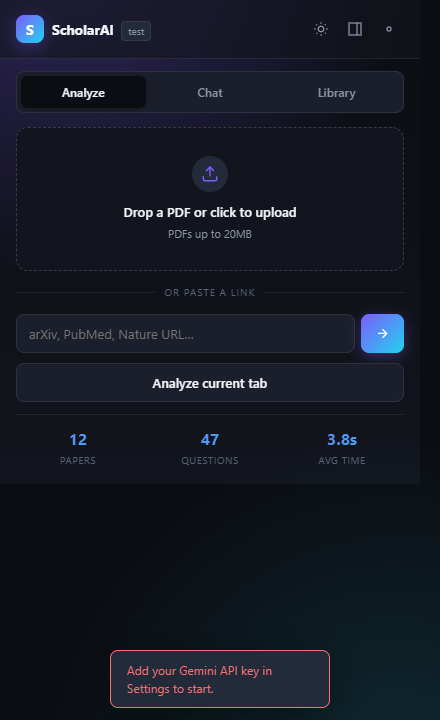
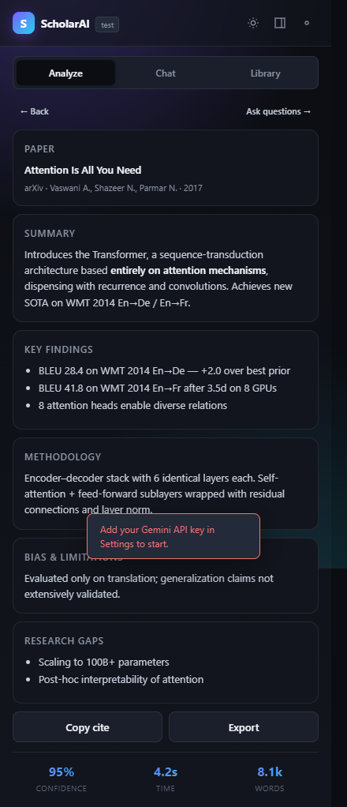
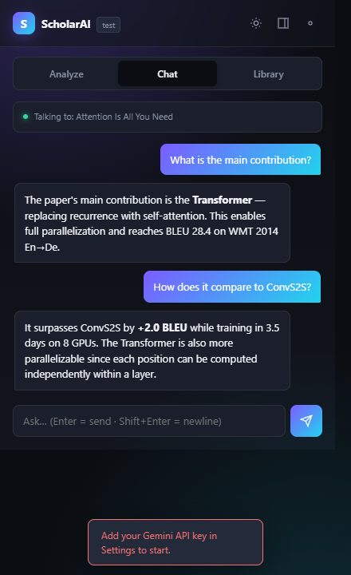
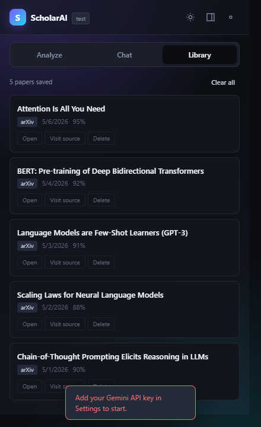
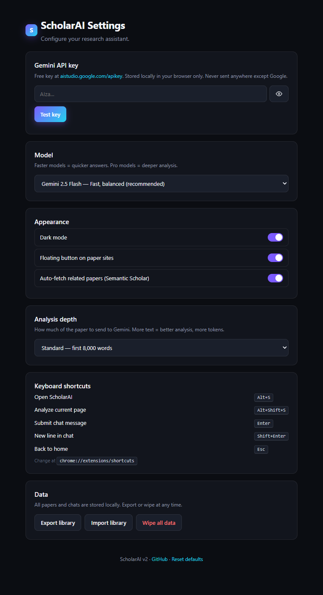

<div align="center">

# ScholarAI

### Your research paper, understood in under 10 seconds.

**Modern Chrome extension that summarizes, chats with, and cites any research paper — arXiv, PubMed, Nature, IEEE, bioRxiv, PDFs, and more.**

[](https://developer.chrome.com/docs/extensions/mv3/intro/)
[](https://aistudio.google.com/)
[](LICENSE)
[](#privacy)

<br/>

<table>
<tr>
<td align="center" width="20%"><br/><sub><b>Analyze</b><br/>Drop a PDF or paste a URL</sub></td>
<td align="center" width="20%"><br/><sub><b>Results</b><br/>Summary · findings · gaps</sub></td>
<td align="center" width="20%"><br/><sub><b>Chat</b><br/>Multi-turn Q&A</sub></td>
<td align="center" width="20%"><br/><sub><b>Library</b><br/>Reopen any analysis</sub></td>
<td align="center" width="20%"><br/><sub><b>Settings</b><br/>Bring-your-own key</sub></td>
</tr>
</table>

</div>

---

## Why

Academic papers are dense. You've got ten tabs open, a deadline, and three journals with different layouts. ScholarAI lives one click away in your Chrome toolbar and turns any paper into a structured briefing: summary, key findings, methodology, limitations, research gaps — plus a chat that actually knows what you're reading.

No accounts. No servers between you and the model. Bring your own free Gemini key, and it's yours.

---

## Features

| Category | What you get |
|---|---|
| **Analyze** | One-click summary · key findings · methodology · bias & limitations · research gaps |
| **Chat** | Multi-turn Q&A that remembers the paper and your conversation |
| **Library** | Every paper you analyze is saved locally and searchable |
| **Citations** | APA, MLA, BibTeX — copy or export |
| **Export** | Full analysis to Markdown · library to JSON |
| **Sources** | arXiv, bioRxiv, medRxiv, PubMed, Nature, Science, ScienceDirect, IEEE, ACM, Springer, Semantic Scholar, Google Scholar, any HTML, PDFs up to 20MB |
| **Related work** | Automatic lookups via Semantic Scholar |
| **UI** | Glass-morphism · dark + light · popup + side panel |
| **Shortcuts** | <kbd>Alt+S</kbd> to open · <kbd>Alt+Shift+S</kbd> to analyze current tab |
| **Context menu** | Analyze page · analyze selection · open side panel |
| **Floating button** | Appears automatically on paper sites (toggleable) |
| **Privacy** | Zero analytics. Zero tracking. Your key, your machine. |

---

## Install

### Load unpacked (today)

```bash
git clone https://github.com/vaibhav4046/Scholar.AI-Chrome-Extension.git
```

1. Open `chrome://extensions/`
2. Toggle **Developer mode** in the top-right
3. Click **Load unpacked** → select the cloned folder
4. Pin **ScholarAI** to your toolbar
5. Grab a free Gemini key at [aistudio.google.com/apikey](https://aistudio.google.com/apikey)
6. Click the extension icon → ⚙ → paste key → **Test key**
7. You're done

### Chrome Web Store

Coming soon. In the meantime the unpacked install is fast and reliable.

---

## Use

### Analyze a paper

| Where you are | What to do |
|---|---|
| On arXiv / PubMed / Nature / any paper site | Click the floating **Analyze** button, or <kbd>Alt+Shift+S</kbd> |
| On any page | Right-click → **ScholarAI: Analyze this page** |
| Have a URL | Paste into the popup, hit Enter |
| Have a PDF file | Drag onto the popup, or click to browse |
| Want to analyze a snippet | Highlight text → right-click → **Analyze selected text** |

Results land in the **Analyze** tab: summary, findings, methodology, limitations, research gaps, related papers (if enabled), plus confidence and word count. Copy the citation or export to Markdown with one click.

### Chat with the paper

Switch to the **Chat** tab. Type a question, get an answer grounded in the paper. Conversation history sticks around between popup opens thanks to session storage.

Pre-baked suggestions to get you rolling:
- What is the main contribution?
- Explain the methodology step by step.
- What are the key limitations?
- How does this compare to prior work?

### Library

The **Library** tab lists every paper you've analyzed. Click to re-open, hover for actions (open source page, delete). Export the whole library to JSON from Settings, import it on another machine.

### Side panel

Prefer a persistent panel while you read? Click the panel icon in the top-right of the popup, or right-click any page → **ScholarAI: Open side panel**. Same tabs, full height, stays open.

---

## Architecture

```
┌─ Content script ──────────────────────────────┐
│ Detects paper sites                           │
│ Structured extractors (arXiv, PubMed, …)      │
│ Floating action button                        │
└─────────────┬─────────────────────────────────┘
              │ extracted text + meta
┌─────────────▼─────────────────────────────────┐
│ Popup / Side panel (shared popup.js)          │
│ - Tabs: Analyze · Chat · Library              │
│ - Renders results, manages chat history       │
│ - chrome.storage.local (library, settings)    │
│ - chrome.storage.session (current paper+chat) │
└─────────────┬─────────────────────────────────┘
              │ chrome.runtime.sendMessage
┌─────────────▼─────────────────────────────────┐
│ Background service worker (module)            │
│ - Gemini API client (inlineData for PDF)      │
│ - CORS-free URL fetcher + HTML parser         │
│ - Semantic Scholar related lookup             │
│ - Citation builders (APA, MLA, BibTeX)        │
│ - Context menus · keyboard commands           │
└───────────────────────────────────────────────┘
```

---

## File layout

```
Scholar.AI-Chrome-Extension/
├── manifest.json          Manifest V3, permissions, entry points, commands
├── background.js          Service worker (module): Gemini, URL fetch, related, citations
├── content.js             Page extractors + floating action button
├── content.css            Floating button + flash toast (scoped, !important)
├── popup.html             Popup markup with tabs
├── popup.js               All popup logic — also loaded by sidepanel.html
├── sidepanel.html         Side panel shell (reuses popup.js)
├── options.html           Settings UI
├── options.js             Settings save/load, key testing, data export/import/wipe
├── styles.css             Shared design tokens + components
├── icon16.png / 48 / 128  Branded icons
├── README.md              This file
├── CHANGELOG.md           Version history
├── CONTRIBUTING.md        How to contribute
└── LICENSE                MIT
```

---

## Privacy

> **Your data doesn't leave the extension, except when it goes straight to Google.**

- **Your Gemini API key** lives exclusively in `chrome.storage.local` on your machine.
- **Paper content** goes to Google's Gemini API over HTTPS. Nothing else.
- **Related-paper lookups** send only the paper title to `api.semanticscholar.org`. Disable in Settings.
- **No analytics.** No telemetry. No third-party server in between. Check the source.

---

## Supported paper sources

Rich structured extraction on:

- **arXiv** — abstract, authors, title
- **PubMed / NCBI** — abstract, authors, title
- **bioRxiv / medRxiv** — abstract, authors, title
- **Nature** — abstract, authors, title
- **Science** — abstract, authors, title
- **ScienceDirect** — abstract, authors, title
- **IEEE Xplore** — abstract, authors, title
- **ACM Digital Library** — abstract, authors, title
- **Springer Link** — abstract, authors, title
- **Semantic Scholar** — abstract, authors, title
- **Google Scholar** — snippet, authors, title

Plus a smart generic extractor for any other site (prefers `<article>`, `<main>`, citation meta tags) and full Gemini-native PDF parsing for files up to 20MB.

---

## Keyboard shortcuts

| Action | Shortcut |
|---|---|
| Open ScholarAI | <kbd>Alt+S</kbd> |
| Analyze current page | <kbd>Alt+Shift+S</kbd> |
| Submit chat message | <kbd>Enter</kbd> |
| New line in chat | <kbd>Shift+Enter</kbd> |
| Back to home (Analyze tab) | <kbd>Esc</kbd> |

Rebind at `chrome://extensions/shortcuts`.

---

## Settings

Open the cog icon in the popup, or right-click the extension icon → **Options**.

- **API key** — stored locally, test it with one click
- **Model** — Gemini 2.5 Flash (default) · Flash Lite (fastest) · Pro (deepest)
- **Analysis depth** — Quick (3k words) · Standard (8k) · Deep (full text)
- **Theme** — dark / light
- **Floating button** — toggle the FAB on paper sites
- **Related papers** — enable / disable Semantic Scholar lookups
- **Data** — export library, import library, wipe everything

---

## Development

```bash
git clone https://github.com/vaibhav4046/Scholar.AI-Chrome-Extension.git
cd Scholar.AI-Chrome-Extension
# edit, reload at chrome://extensions/, done
```

No build step. No dependencies. Plain JS modules and HTML.

### Smoke tests

```bash
# JS syntax
node --check background.js
node --check popup.js
node --check content.js
node --check options.js

# Manifest shape
python -c "import json; json.load(open('manifest.json'))"
```

See [CONTRIBUTING.md](CONTRIBUTING.md) for the full guide.

---

## Troubleshooting

| Symptom | Fix |
|---|---|
| "No API key" | Settings → paste your Gemini key → Test key |
| "API key invalid or unauthorized" | Regenerate at [aistudio.google.com/apikey](https://aistudio.google.com/apikey) |
| "Rate limit / quota exceeded" | Wait a minute, or upgrade Gemini tier, or use Flash Lite |
| Paper site not extracted well | Select the abstract → right-click → **Analyze selected text** |
| PDF too large | Gemini inline-data cap is 20MB. Compress the PDF first. |
| Side panel button does nothing | Needs Chrome 114+ |
| Floating button doesn't appear | Settings → toggle "Floating button on paper sites" |

---

## Roadmap

- [ ] Chrome Web Store listing
- [ ] Highlight-to-explain overlay on long PDFs
- [ ] BibTeX export for entire library at once
- [ ] Optional OpenAI / Anthropic backends
- [ ] Translation to user's language before summarization
- [ ] Audio summary via Web Speech API
- [ ] Collections inside Library (group by topic)

---

## Credits

- **Google Gemini** for the inference backbone
- **Semantic Scholar** for related-paper lookups
- All researchers who put their papers online open-access

---

## License

[MIT](LICENSE)

---

<div align="center">
  Built by <a href="https://github.com/vaibhav4046">Vaibhav Lalwani</a> · <a href="https://linkedin.com/in/vaibhav-lalwani">LinkedIn</a>
  <br>
  <sub>v2.0.0 · 2026</sub>
</div>
